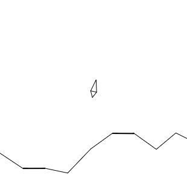
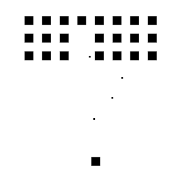

# DO180-Retro-Games charts

Versiones esqueléticas de Asteroids, Lunar Lander, Snake y Space Invaders en JavaScript.
Escrito como práctica para el taller de Strange Loop 2014.

Creamos de manera automática una imágen la cual lleva el contenido del directorio "asteroids", "lunar-lander", "snake" o "space-invaders".

Como las aplicaciones son JavaScript puras (no Node.js), OpenShift no sabe cómo ejecutarla automáticamente porque "oc new-app" está diseñado para aplicaciones tipo servidor como Node.js, Python, Java, etc.

Dado que OpenShift espera un entorno para ejecutar código, pero JavaScript puro (HTML/CSS/JS) no necesita un servidor backend, se necesita una estrategia diferente.

En la carpeta "app" está los archivos para la creación de la aplicacion mediante una imagen.
En la carpeta "helm" está los archivos para la creación de la aplicación mediante Helm.

Para crear la aplicación "retro-games" del curso DO180 de Red Hat podemos hacerlo de dos maneras diferentes pero siempre manteniendo los mismos ficheros.

## helm

Para crear la aplicación Retro-Games debemos ejecutar los siguiente comandos:
```
  1.- helm repo add apps https://fernando0069.github.io/my-charts/                                              # Creación del repositorio donde vamos a descargar la aplicación
  2.- helm install retro-games apps/DO180-Retro-Games                                                           # Instalar la aplicación "DO180-Retro-Games" con el nombre "retro-games".
  3.- curl -vvv https://retro-games-asteroids-fernando0069-dev.apps.rm2.thpm.p1.openshiftapps.com               # Verificar la URL. 
  4.- curl -vvv https://retro-games-lunar-lander-fernando0069-dev.apps.rm2.thpm.p1.openshiftapps.com            # Verificar la URL. 
  5.- curl -vvv https://retro-games-snake-fernando0069-dev.apps.rm2.thpm.p1.openshiftapps.com                   # Verificar la URL. 
  6.- curl -vvv https://retro-games-space-invaders-fernando0069-dev.apps.rm2.thpm.p1.openshiftapps.com          # Verificar la URL. 
```

Para eliminar la aplicación Retro-Games debemos ejecutar los siguiente comandos:
```
  1.- helm uninstall retro-games                                   # Desinstalar la aplicación con el nombre "retro-games" ("DO180-Retro-Games").
  2.- helm repo remove apps                                        # Eliminación del repositorio de aplicaciones.
```

Los objetos que se crean son los siguientes:
```
  1.- Imagestream (4).
  2.- BuildConfig (4).
  3.- Deployment (4).
  5.- Service (4).
  6.- Route (4).
```


## cli

### Asteroids:


Usando imagestream con la versión del compilador:
```
  oc new-app -S httpd
  oc new-app --name=retro-games-asteroids httpd:2.4-ubi9~https://github.com/Fernando0069/my-charts.git --context-dir=apps/do180-retro-games/app/src/asteroids -l app=retro-games-asteroids
  oc create route edge --service=retro-games-asteroids     # crea ruta segura del tipo edge
  curl -vvv https://retro-games-asteroids-fernando0069-dev.apps.sandbox-m2.ll9k.p1.openshiftapps.com/
  oc delete all -l app=retro-games-asteroids
```

Los objetos que se crean son los siguientes:
```
  1.- Imagestream.
  2.- BuildConfig.
  3.- Deployment.
  4.- Service.
  5.- Route.
```


### Lunar Lander:



Usando imagestream con la versión del compilador:
```
  oc new-app -S httpd
  oc new-app --name=retro-games-lunar-lander httpd:2.4-ubi9~https://github.com/Fernando0069/my-charts.git --context-dir=apps/do180-retro-games/app/src/lunar-lander -l app=retro-games-lunar-lander
  oc create route edge --service=retro-games-lunar-lander     # crea ruta segura del tipo edge
  curl -vvv https://retro-games-lunar-lander-fernando0069-dev.apps.sandbox-m2.ll9k.p1.openshiftapps.com/
  oc delete all -l app=retro-games-lunar-lander
```

Los objetos que se crean son los siguientes:
```
  1.- Imagestream.
  2.- BuildConfig.
  3.- Deployment.
  4.- Service.
  5.- Route.
```


### Snake:


Usando imagestream con la versión del compilador:
```
  oc new-app -S httpd
  oc new-app --name=retro-games-snake httpd:2.4-ubi9~https://github.com/Fernando0069/my-charts.git --context-dir=apps/do180-retro-games/app/src/snake -l app=retro-games-snake
  oc create route edge --service=retro-games-snake     # crea ruta segura del tipo edge
  curl -vvv https://retro-games-snake-fernando0069-dev.apps.sandbox-m2.ll9k.p1.openshiftapps.com/
  oc delete all -l app=retro-games-snake
```

Los objetos que se crean son los siguientes:
```
  1.- Imagestream.
  2.- BuildConfig.
  3.- Deployment.
  4.- Service.
  5.- Route.
```


### Space Invaders:



Usando imagestream con la versión del compilador:
```
  oc new-app -S httpd
  oc new-app --name=retro-games-space-invaders httpd:2.4-ubi9~https://github.com/Fernando0069/my-charts.git --context-dir=apps/do180-retro-games/app/src/space-invaders -l app=retro-games-space-invaders
  oc create route edge --service=retro-games-space-invaders     # crea ruta segura del tipo edge
  curl -vvv https://retro-games-space-invaders-fernando0069-dev.apps.sandbox-m2.ll9k.p1.openshiftapps.com/
  oc delete all -l app=retro-games-space-invaders
```

Los objetos que se crean son los siguientes:
```
  1.- Imagestream.
  2.- BuildConfig.
  3.- Deployment.
  4.- Service.
  5.- Route.
```
