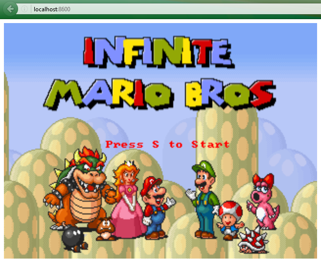

# DO180-Super-Mario-HTML5 charts



En la carpeta "app" está los archivos para la creación de la aplicacion mediante una imagen.
En la carpeta "helm" está los archivos para la creación de la aplicación mediante Helm.

Creamos de manera automática una imágen la cual lleva el contenido del directorio "src".

Como la aplicación es JavaScript puro (no Node.js), OpenShift no sabe cómo ejecutarla automáticamente porque "oc new-app" está diseñado para aplicaciones tipo servidor como Node.js, Python, Java, etc.

Dado que OpenShift espera un entorno para ejecutar código, pero JavaScript puro (HTML/CSS/JS) no necesita un servidor backend, se necesita una estrategia diferente.

Para crear la aplicación "super-mario-html5" del curso DO180 de Red Hat podemos hacerlo de dos maneras diferentes pero siempre con los mismos archivos.


## helm

Para crear la aplicación "Super-Mario-HTML5" debemos ejecutar los siguiente comandos:
```
  1.- helm repo add apps https://fernando0069.github.io/my-charts/                                 # Creación del repositorio donde vamos a descargar la aplicación.
  2.- helm install super-mario-html5 apps/DO180-Super-Mario-HTML5                                                  # Instalar la aplicación "DO180-Super-Mario-HTML5" con el nombre "super-mario-html5".
  3.- curl -vvv https://super-mario-html5-fernando0069-dev.apps.rm2.thpm.p1.openshiftapps.com              # Verificar la URL. 
```

Para eliminar la aplicación "Super-Mario-HTML5" debemos ejecutar los siguiente comandos:
```
  1.- helm uninstall super-super-mario-html5                      # Desinstalar la aplicación con el nombre "super-mario-html5" ("DO180-Super-Mario-HTML5").
  2.- helm repo remove apps                            # Eliminación del repositorio de aplicaciones.
```

Los objetos que se crean son los siguientes:
```
  1.- Imagestream
  2.- BuildConfig.
  3.- Deployment.
  4.- Service.
  5.- Route.
```


## cli

Usando imagestream con la versión del compilador:
```
  oc new-app -S httpd
  oc new-app --name=super-mario-html5 httpd~https://github.com/Fernando0069/my-charts.git --context-dir=apps/do180-super-mario-html5/app/src -l app=super-mario-html5
  oc create route edge --service=super-mario-html5     # crea ruta segura del tipo edge
  curl -vvv https://super-mario-html5-fernando0069-dev.apps.sandbox-m2.ll9k.p1.openshiftapps.com/
  oc delete all -l app=super-mario-html5
```

Los objetos que se crean son los siguientes:
```
  1.- Imagestream.
  2.- BuildConfig.
  3.- Deployment.
  4.- Service.
  5.- Route.
```
